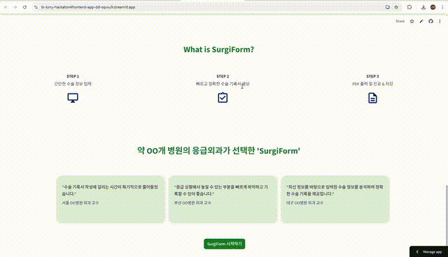

# SurgiForm

빠르고 정확하게 수술 동의서를 작성해야 하는 병원 현장의 문제를 해결하고자  
저희는 환자 맞춤형 수술 동의서를 자동으로 생성하는 인공지능 기반의 의료 문서 지원 시스템 **SurgiForm**을 개발했습니다.  

본 레포지토리에서는 데모 URL, 영상, 샘플 문서와 함께 SurgiForm의 기능을 소개합니다.

---

## 💡 주요 기능 & 기술적 주안점
1. **메인 페이지**  
   - SurgiForm의 필요성 및 해결 방안 소개  
2. **기본 정보 입력 페이지**  
   - 환자·수술 기본 정보 입력  
   - POSSUM SCORE 계산기 탑재
   - 직관적이고 쉬운 UI  
3. **수술 정보 입력 페이지**  
   - 두 번의 LLM 호출  
     1. UpToDate 기반 Textbook에서 최신 전문 정보 조회  
     2. 조회된 정보를 “쉬운 말”로 재설명  
   - 출처명시 ✓, 수정·보완 가능 ✓  
   - 추가 수정 시 **챗봇** 기능 활용 가능  
4. **수술동의서 설명 및 서명 페이지**  
   - 수술 설명 시 필요에 따라 **캔버스** 추가 가능  
   - 추후 **녹음 기능** 계획 중  
5. **수술동의서 PDF 출력 페이지**  
   - 확정된 동의서를 **PDF** 형식으로 변환·저장

---

## 🔗 Demo

- **서비스 접속**: [http://surgi-form.com/](http://surgi-form.com/)

>해당 데모는 실제 환자의 증상, 계획된 수술명, 수술 목적 등의 정보를 기반으로  
의료 전문가가 참고하는 신뢰도 높은 근거 문헌을 자동으로 탐색하고,  
>그 내용을 요약 및 변환하여 환자 친화적인 수술 동의서를 생성하는 전체 프로세스를 시연합니다.

- **시연 시 주의사항**
1. Basic Information 페이지에서 'Possum 점수 계산'을 먼저 한 후에 기타 정보들을 입력하시기 바랍니다. 정보가 날아갈 수 있습니다.
2. 각 페이지 하단에 있는 "버튼을 누른 후, 완료되었다는 메시지가 뜨면" 페이지 상단에 있는 "Stepper를 이용"하여 다음 단계로 넘어가시기 바랍니다.
> 앞으로도 지속적인 업데이트와 후속 개발을 통해 완성도를 높여 나가겠습니다!

- **📹 데모 영상**
  

>간단한 워크플로우를 GIF로 확인해보세요. 전체 영상은 [여기서 보기](src/SurgiForm_demo_3x.mp4).
>>
>본 영상에서는 입력 인터페이스, 의료 문헌 검색 및 요약, 문서 자동 생성까지의 주요 기능을 설명합니다.

- **📄 샘플 수술 동의서**

> [`수술동의서.pdf`](src/수술동의서.pdf)
>: 생성된 수술 동의서 샘플로, 실제 의료 현장에서 활용 가능한 수준의 표현과 구조를 반영하고 있습니다.

---

## 🚀 페이지별 소개

### 1. 메인 페이지
메인 페이지는 외상응급의학과에 SurgiForm이 필요한 이유와 이를 어떠한 기술을 통해 해결하였는지를 소개하는 페이지입니다.  

---

### 2. 기본 정보 입력 페이지
Reference 기반의 수술 정보를 생성하기 위해, 수술과 환자에 관한 가장 기본적인 정보들을 입력하는 페이지입니다.  
현재의 수술동의서와 굉장히 유사한 형태의 UI로 제작되어 사용자(의사 선생님)가 익숙하고 빠르게 작성할 수 있도록 하였습니다.  

또한, 수술의 위험도를 엿볼 수 있는 **POSSUM SCORE 계산기 알고리즘**을 만들어 진단에 도움이 될 수 있도록 하였습니다.

---

### 3. 수술 정보 입력 페이지
그 정보들을 바탕으로 SurgiForm은 총 **두 번의 LLM**을 거쳐 수술 정보를 빠르고 정확하게 생성합니다.  
1. UpToDate 기반 Textbook에서 수술과 관련된 최신의 전문적인 정보들을 조회하는 LLM  
2. 조회된 정보를 좀 더 쉬운 말로 풀어 설명해 주는 LLM  

그 두 LLM을 거친 정보가 수술 정보 입력 페이지에 출처와 함께 제공됩니다.  

의사 선생님들께서는 출처와 함께 생성된 정보를 보고 수정할 수 있으며, 추가적인 정보가 필요할 경우 **챗봇**의 도움을 받을 수도 있습니다.

---

### 4. 수술동의서 설명 및 서명 페이지
수술에 대한 모든 정보가 확정되면, 설명 및 서명 페이지로 이동하게 됩니다.  

여러 수술 설명은 그림을 그리며 진행되는 경우가 많다고 하여, 항목별로 필요할 경우 **캔버스**를 추가할 수 있도록 발전시켰습니다.  
추후 **녹음 기능**을 추가할 예정입니다.

---

### 5. 수술동의서 PDF 출력 페이지
끝으로 환자와 의사가 서명을 마무리하면 확정된 수술동의서를 **PDF 형식**으로 출력하여 저장할 수 있습니다.

